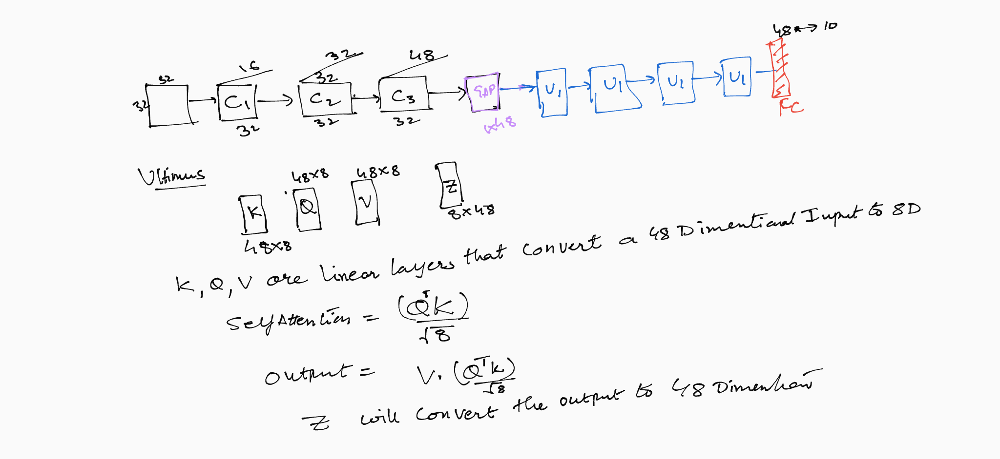
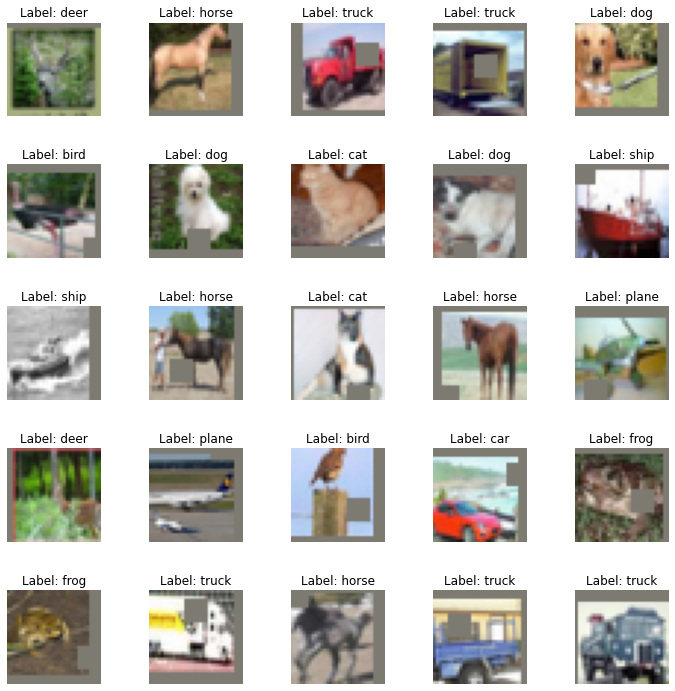
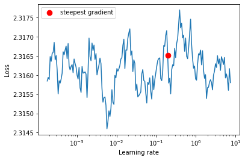
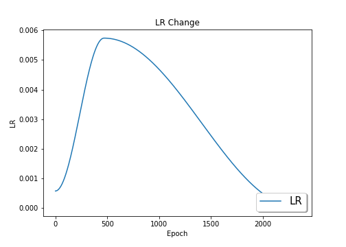
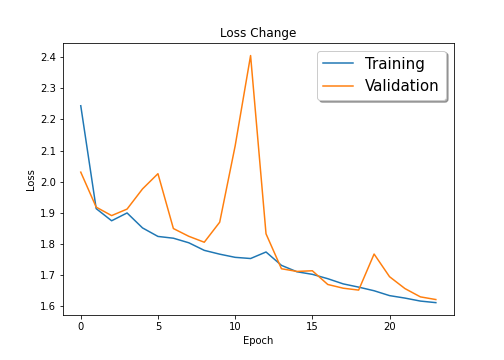
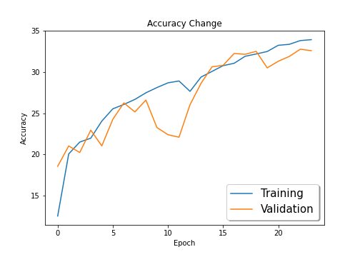

## This is solution for the Dawn Of Transformers (Assignment#9)

The important part of the assignment is the model that implements a self attention mechanism in the Ultimus block


The implementation of the model is in [UltimusModel.py](https://github.com/TSAI-EVA8/StarterKit/blob/master/models/ultimusModel.py)


The following image captures the essence of the model





## Code File
I am making use of a code repository StarterKit

 * The repo is first cloned in this project using
git clone https://github.com/TSAI-EVA8/StarterKit

* The trainiing notebook is [Ultimus.ipynb](https://github.com/TSAI-EVA8/dawnTransformer/blob/master/Ultimus.ipynb) which makes use of the code in the StarterKit to perform the training. All the logic is present in the StarterKit


## Data Set

We have used the CIFAR-10 dataset

## Transformations
The following transformations have been used for the training data
1. RandomCrop(32) with padding of 4
2. RandomHorizontalFlip
3. CutOut (8,8)

The following code implements it
```
transform_train = transforms.Compose(
    [transforms.ToTensor(),  
     transforms.Normalize((0.49139968, 0.48215841, 0.44653091), (0.24703223, 0.24348513, 0.26158784)),
     transforms.RandomCrop(32,4),
     transforms.RandomHorizontalFlip(p = Args.horizontal_flip_prob),
    ])
transform_train.transforms.append(utility.CutOut(n_holes=1, length=8,p=Args.cutout_prob))


```
After the transformation the following images are obtained




## One Cycle Policy

we had to implement the once cycle policy for the training 

1. Use the find_lr function to get the max LR
our max LR is 0.0057384416483023965




## Training 
* The model has 26K trainable parameters
* The model is trained fro 24 epochs
* Optimizer : Adam

## Results
The model did not train much . I could get only 32% test accuracy.
I think one of the reasons could be the number of parameters are very less and the data set is complex. May be removing the transformation can help.

After the training we can see the learning rate varies in the following manner


Following are the plots :

Training versus Testing loss




Training versus test Accuracy




## Training Logs
EPOCH: 1 (LR: 0.0005738441648302393)
Batch_id=97 Loss=2.24390 Accuracy=12.48%: 100%|█████████████████████| 98/98 [00:07<00:00, 13.79it/s]

Test set: Average loss: 2.0309, Accuracy: 1853/10000 (18.53%)

EPOCH: 2 (LR: 0.00110966145699197)
Batch_id=97 Loss=1.91373 Accuracy=20.04%: 100%|█████████████████████| 98/98 [00:06<00:00, 14.09it/s]

Test set: Average loss: 1.9185, Accuracy: 2101/10000 (21.01%)

EPOCH: 3 (LR: 0.002494753181307849)
Batch_id=97 Loss=1.87484 Accuracy=21.48%: 100%|█████████████████████| 98/98 [00:07<00:00, 13.77it/s]

Test set: Average loss: 1.8914, Accuracy: 2021/10000 (20.21%)

EPOCH: 4 (LR: 0.004154316674458137)
Batch_id=97 Loss=1.89989 Accuracy=21.96%: 100%|█████████████████████| 98/98 [00:07<00:00, 13.92it/s]

Test set: Average loss: 1.9123, Accuracy: 2293/10000 (22.93%)

EPOCH: 5 (LR: 0.005399645550385868)
Batch_id=97 Loss=1.85189 Accuracy=24.03%: 100%|█████████████████████| 98/98 [00:07<00:00, 13.94it/s]

Test set: Average loss: 1.9770, Accuracy: 2102/10000 (21.02%)

EPOCH: 6 (LR: 0.005736748085590433)
Batch_id=97 Loss=1.82455 Accuracy=25.53%: 100%|█████████████████████| 98/98 [00:07<00:00, 13.96it/s]

Test set: Average loss: 2.0259, Accuracy: 2425/10000 (24.25%)

EPOCH: 7 (LR: 0.005682483999856224)
Batch_id=97 Loss=1.81886 Accuracy=26.06%: 100%|█████████████████████| 98/98 [00:07<00:00, 13.93it/s]

Test set: Average loss: 1.8499, Accuracy: 2625/10000 (26.25%)

EPOCH: 8 (LR: 0.005553221563049445)
Batch_id=97 Loss=1.80417 Accuracy=26.67%: 100%|█████████████████████| 98/98 [00:07<00:00, 13.87it/s]

Test set: Average loss: 1.8249, Accuracy: 2515/10000 (25.15%)

EPOCH: 9 (LR: 0.005352413806054755)
Batch_id=97 Loss=1.77990 Accuracy=27.48%: 100%|█████████████████████| 98/98 [00:06<00:00, 14.03it/s]

Test set: Average loss: 1.8060, Accuracy: 2659/10000 (26.59%)

EPOCH: 10 (LR: 0.005085424973922068)
Batch_id=97 Loss=1.76763 Accuracy=28.11%: 100%|█████████████████████| 98/98 [00:07<00:00, 13.94it/s]

Test set: Average loss: 1.8703, Accuracy: 2325/10000 (23.25%)

EPOCH: 11 (LR: 0.004759387228987069)
Batch_id=97 Loss=1.75747 Accuracy=28.69%: 100%|█████████████████████| 98/98 [00:06<00:00, 14.07it/s]

Test set: Average loss: 2.1149, Accuracy: 2238/10000 (22.38%)

EPOCH: 12 (LR: 0.004383010127023542)
Batch_id=97 Loss=1.75368 Accuracy=28.92%: 100%|█████████████████████| 98/98 [00:07<00:00, 13.69it/s]

Test set: Average loss: 2.4050, Accuracy: 2207/10000 (22.07%)

EPOCH: 13 (LR: 0.003966347955955051)
Batch_id=97 Loss=1.77461 Accuracy=27.65%: 100%|█████████████████████| 98/98 [00:06<00:00, 14.12it/s]

Test set: Average loss: 1.8330, Accuracy: 2603/10000 (26.03%)

EPOCH: 14 (LR: 0.003520531152285107)
Batch_id=97 Loss=1.73175 Accuracy=29.39%: 100%|█████████████████████| 98/98 [00:07<00:00, 13.82it/s]

Test set: Average loss: 1.7208, Accuracy: 2863/10000 (28.63%)

EPOCH: 15 (LR: 0.0030574689700089103)
Batch_id=97 Loss=1.71119 Accuracy=30.08%: 100%|█████████████████████| 98/98 [00:06<00:00, 14.07it/s]

Test set: Average loss: 1.7123, Accuracy: 3064/10000 (30.64%)

EPOCH: 16 (LR: 0.002589531344711889)
Batch_id=97 Loss=1.70294 Accuracy=30.78%: 100%|█████████████████████| 98/98 [00:07<00:00, 13.81it/s]

Test set: Average loss: 1.7144, Accuracy: 3082/10000 (30.82%)

EPOCH: 17 (LR: 0.002129218451326209)
Batch_id=97 Loss=1.68893 Accuracy=31.07%: 100%|█████████████████████| 98/98 [00:07<00:00, 13.95it/s]

Test set: Average loss: 1.6704, Accuracy: 3226/10000 (32.26%)

EPOCH: 18 (LR: 0.001688826782759873)
Batch_id=97 Loss=1.67226 Accuracy=31.92%: 100%|█████████████████████| 98/98 [00:07<00:00, 13.88it/s]

Test set: Average loss: 1.6584, Accuracy: 3216/10000 (32.16%)

EPOCH: 19 (LR: 0.001280120669552132)
Batch_id=97 Loss=1.66188 Accuracy=32.20%: 100%|█████████████████████| 98/98 [00:07<00:00, 13.97it/s]

Test set: Average loss: 1.6524, Accuracy: 3252/10000 (32.52%)

EPOCH: 20 (LR: 0.0009140180153609797)
Batch_id=97 Loss=1.65026 Accuracy=32.50%: 100%|█████████████████████| 98/98 [00:07<00:00, 13.89it/s]

Test set: Average loss: 1.7681, Accuracy: 3051/10000 (30.51%)

EPOCH: 21 (LR: 0.0006002986433361667)
Batch_id=97 Loss=1.63464 Accuracy=33.26%: 100%|█████████████████████| 98/98 [00:07<00:00, 13.89it/s]

Test set: Average loss: 1.6954, Accuracy: 3131/10000 (31.31%)

EPOCH: 22 (LR: 0.0003473430444190433)
Batch_id=97 Loss=1.62671 Accuracy=33.37%: 100%|█████████████████████| 98/98 [00:06<00:00, 14.05it/s]

Test set: Average loss: 1.6572, Accuracy: 3190/10000 (31.90%)

EPOCH: 23 (LR: 0.0001619085064736229)
Batch_id=97 Loss=1.61712 Accuracy=33.83%: 100%|█████████████████████| 98/98 [00:07<00:00, 13.76it/s]

Test set: Average loss: 1.6306, Accuracy: 3278/10000 (32.78%)

EPOCH: 24 (LR: 4.8948604586568715e-05)
Batch_id=97 Loss=1.61208 Accuracy=33.94%: 100%|█████████████████████| 98/98 [00:07<00:00, 13.97it/s]

Test set: Average loss: 1.6220, Accuracy: 3260/10000 (32.60%)


## Class level Accuracy

```
Accuracy of plane : 41 %
Accuracy of   car : 66 %
Accuracy of  bird :  7 %
Accuracy of   cat :  7 %
Accuracy of  deer : 18 %
Accuracy of   dog :  0 %
Accuracy of  frog : 81 %
Accuracy of horse : 36 %
Accuracy of  ship : 41 %
Accuracy of truck : 24 %


```